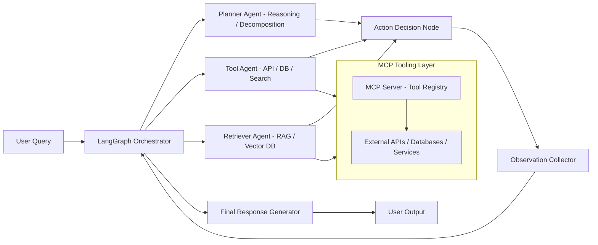
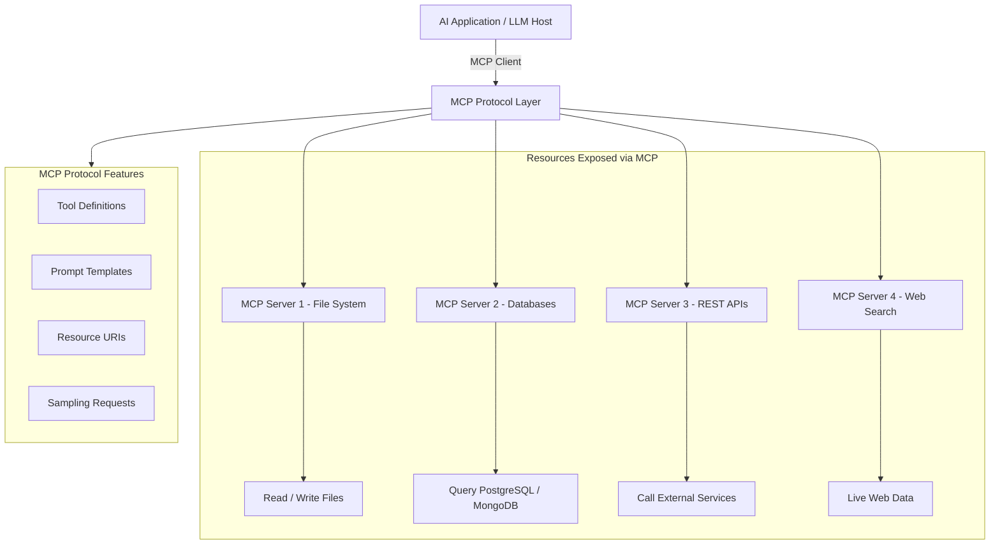

<h1 align="center">Hi 👋, I'm Praneeth</h1>
<h3 align="center">Generative AI Engineer | LLM Systems Architect | Multi-Agent Workflow Builder</h3>

  

  
  
  

---

## 🛠️ GenAI Stack

  
  
  
  
  
  
  
  
  
  
  
  

---

## 🧠 About Me

- 🔭 I build production-grade Generative AI systems using LLMs, RAG pipelines, and agent frameworks  
- 🧩 Strong experience in designing scalable AI architectures for real-world enterprise use cases  
- ⚙️ Specializing in LangChain, LangGraph, LLM orchestration, and vector databases  
- ☁️ Experience deploying AI systems on AWS, Azure & GCP with containerized microservices  
- 🚀 Focused on building fast, reliable, and cost-efficient AI systems  

---

## 🛠️ Tech Stack

| Category | Technologies |
|---|---|
| **Languages** | Python, SQL, Bash |
| **LLMs** | GPT-4, Claude, Gemini, LLaMA, Mistral, DeepSeek |
| **LLM Frameworks** | LangChain, LangGraph, LlamaIndex, AutoGen, LangSmith |
| **RAG & Vector DBs** | Pinecone, FAISS, ChromaDB, Weaviate, HyDE, CRAG |
| **Fine-Tuning** | LoRA, QLoRA, PEFT, Hugging Face Transformers |
| **Cloud & MLOps** | AWS Bedrock, Azure OpenAI, GCP Vertex AI, Docker, MLflow |
| **Backend** | FastAPI, Flask |

---

## 🧩 Multi-Agent LLM Orchestration Architecture

---

## 🔌 MCP (Model Context Protocol) Architecture

> MCP is an open standard by Anthropic that allows AI models to securely connect to external tools, data sources, and services through a unified protocol layer — replacing fragmented custom integrations with one standard.

---

## 🚀 Featured Projects

### 🔹 AI Chatbot with RAG (LangChain + Vector DB)
- Built a contextual chatbot using retrieval-augmented generation
- Implemented memory handling and document embeddings
- Reduced hallucination using hybrid search strategy

### 🔹 Local Knowledge Base Assistant
- Chat with your own documents using embeddings + vector search
- Integrated ChromaDB for persistent storage

### 🔹 Multi-Agent AI System
- Designed orchestration layer for multiple LLM agents
- Task decomposition + tool-based execution pipeline

---

## 📊 GitHub Stats

  

  

---

## 🧩 Key Strengths

- Building **end-to-end AI products**, not just models  
- Strong focus on **real-world scalability & cost optimization**
- Experience in **LLM system design & orchestration**
- Ability to bridge **backend engineering + AI research concepts**
- Up-to-date with **MCP, agentic frameworks & frontier LLMs**

---

  ⚡ "I don't just use AI models — I build systems around them that solve real problems."

